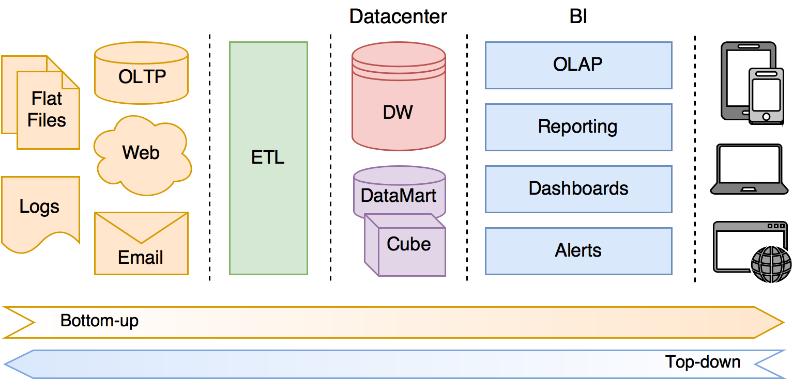
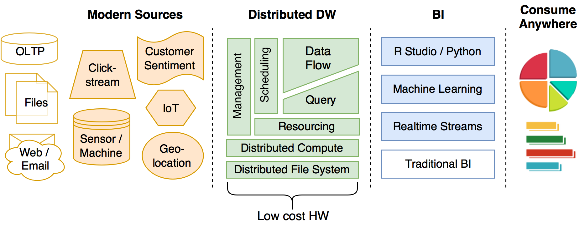
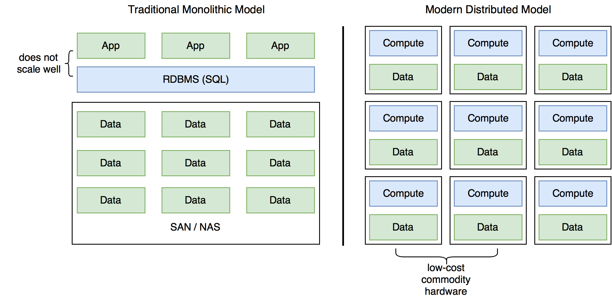
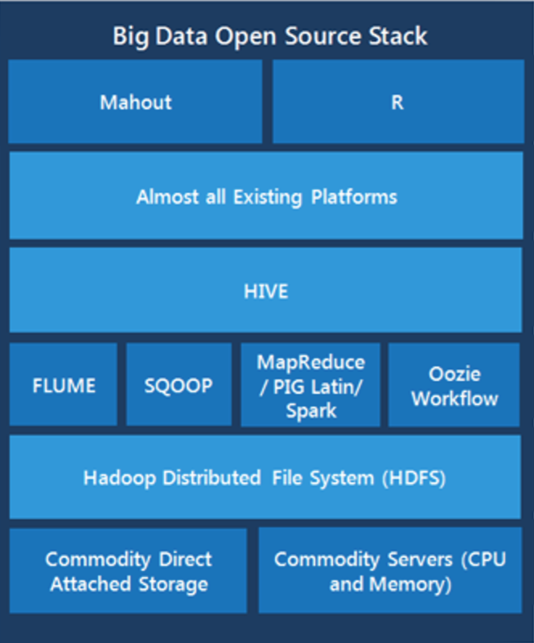

*Other versions of this document*, [PDF](http://slight.me/whitepaper/whitepaper.pdf), [HTML](http://slight.me/whitepaper/whitepaper.html), [Word](http://slight.me/whitepaper/whitepaper.docx), [Markdown](http://slight.me/whitepaper/whitepaper.md)

MODERN DATA SCIENCE FOR BUSINESS
================================
*A study of the current business intelligence and related landscapes, prepared by [Slight Data Science](http://slight.me/) LLC.*

Contents
--------
1. [Executive Summary](#executive-summary)
2. [Why Data Science?](#2-why-data-science-)
3. [Traditional Models and Shortfalls](#3-traditional-bi-models-and-shortfalls)
4. [Modern Models and Advantages](#4-modern-models-amp-advantages)
5. [The Six Core Business Data Science Competencies](#5-core-business-data-science-competencies)
6. [Current Business Landscape](#6-current-business-landscape)
    + [Big Data & Hadoop](#big-data-hadoop)
    + [Open vs. Proprietary](#open-vs-proprietary)
    + [Python & R](#python-r)
    + [Machine Learning](#machine-learning)
7. [Business Implications](#7-business-implications)
8. [Practical Applications](#8-practical-applications)

## 1. Executive summary

> "Data is the Next Intel Inside." ~ Tim O’Reilly

This whitepaper provides:-

  1.  an overview of the current landscape for applied data science within business,
  2.  an analysis of the tools & modes of application; and
  3.  an evaluation of the practical implications available to businesses wishing to conduct data science.

**In fact**, we argue that every business should conduct effective data science in order to remain competitive.

This report provides the historic context of existing data science applications within business, often commonly referred to within organisations as data-warehousing (DW) (the procurement, sanitization and abstraction) and business intelligence (BI) (the analysis, general consumption and presentation of data). We develop the traditional DW/BI model and explain how advances in hardware and software technology provide cost-effective means of disrupting the foundational assumptions of existing data analytics platforms, both from a technical (IT) and business process orientated perspective. We further explore how these advances increase the consumption and computation of data within business, effectively introducing cost-viable ‘Big-Data’ capabilities. We conclude the study by looking at the total impact of this shift on business resourcing requirements.

## Recommendations from our team

**Firstly,** it is essential for every business wishing to remain competitive to conduct effective data science and analytics techniques. This applies equally to small businesses and large enterprises. It should include at a minimum, analysis of customer behaviour, operational efficiency and optimisation of profits.

**Secondly,** whether developing new business competencies or building on existing ones, the business should include key capabilities in six key defined areas. It is recommended that a minimum level of proficiency be achieved in each of those areas in order to effectively achieve a solution which holistically meets the basic needs of a modern business. That is to say that a total deficiency in any one of the six core areas of expertise renders any BI solution potentially not fit for purpose.

**Thirdly,** solutions should be approached from a vendor neutral perspective with additional preference given to ‘open’ platforms. Such an approach ensures the future-proofing of the data science function, allows agile upgrading and minimises the total cost of ownership. It is recommended that proprietary resources and techniques which cause vendor lock-in and provided restricted compatibility with other modules be avoided where practically possible.

## 2. Why Data Science?

The importance of data has been known for a long time. Rulers have undertaken detailed censuses of populations for thousands of years. Around the turn of the 19th century tabulating companies, recording firms and early calculating agencies came to prominence and a merger of three big American firms lead to IBM and the birth of the computing era. Today, in the age of Internet, digital and social media, recorded information is rife. More data has been recorded in the past 4 years than in the whole of the history of humanity combined.

Data science is the formal practice of finding meaning from facts. It is the art of answering and asking the right questions. Most businesses already have a large IT investment and systems dedicated to recording sales data, human resources information, marketing trends, operational statistics and competitive analyses. Making sense of this is the job of data science. Simply put it is the ability to draw conclusions to a specified degree of confidence in a repeatable manner.

How this matters to business is particular to each organisation, including taking into account its mission, values and capabilities. Generally, it can be used to gain better understanding of customers, how markets will react, what actions competitors are likely to take and how a business can perform better.

## 3. Traditional BI Models and Shortfalls

The traditional model of data science application within business is marked by the business disciplines known as Data-Warehousing (commonly DW or DWH) and Business Intelligence (BI). Where large amounts of data are involved (perhaps billions of rows upwards) it may also be termed 'Big Data'. The distinction between DW and BI, together referred to as DW/BI, represents the bottom up and top down approach of solutions from a technical architecture perspective. DW being the bottom-up approach of the design from a data curation and storage perspective and the related functions of extraction load and transformation (ETL). Whilst BI is the top-down approach of data consumption starting at the business requirements and usually comprising at least data visualisation, analysis and often some form of interaction or querying of data. Where DW and BI converge, from a business perspective at least - if not also from a theoretical viewpoint - is a blurred line, in terms of a specific separation of business process or technology application.

Although the distinction between DW and BI in practice may be unclear the complete stack of technologies, processes and methodology are relatively well-defined, even if not always well understood or clearly implemented within business. It has not always been necessary from a strategic business perspective for a company to understand academically the data science principals behind the functional process - as long as operationally the components are well defined, properly integrated and a consistent analytical method is used. That said it is clearly advantageous for companies to have analysts, managers and IT professionals conversant in the theory of data science.

The focus of DW and BI in the past has been technical design integration dealing with a mixture of transactional databases and unstructured data sources. The mixture of data types is partly what makes data science so valuable to businesses, as it is possible to draw on multiple facts to draw new conclusions to steer business decision making. It is not therefore a desire of modern data science to avoid this mixture of data structures, but to handle it in a better fashion. What business impact this has we will come on to shortly. From the business intelligence perspective, the additional challenges of data science traditionally revolve around performance constraints inherent in the DW layer - specifically the speed by which data can be processed, analysed and queried. Modern data science seeks to address these limitations.

### The Traditional Model
First we describe the traditional data science model as applied to most businesses in order to highlight the weaknesses, afterwards we compare this against the modern model to underline the advantages to be gained from newer ways of working (and thinking).

The traditional model essentially comprises a thick DW backend. This is usually large traditional dedicated database, not distributed and often row based data store. The data warehouse store is the first stage intermediary store, essentially a waiting space sitting before data-marts and/or cubes which are designed to be queried against. Each data-mart or cube must be carefully crafted for the function to which it is designed and generally is not all-purpose for open analysis. The number of dimensions and the computational power of these data-marts and cubes is relatively lower than the modern distributed counterparts, unless employing specialist hardware. Sitting between the source data and the DW backend is a thick ETL layer, which is responsible for fetching data from sources, transposing to a standard format and loading into a data warehouse. And the right hand side of the model is the BI layer which performs on-line analysis (OLAP), reporting, dashboard creation, and other final preparations before the data is consumed. At the far right of the model are client applications for displaying analysis and performing a small degree of data manipulation.

Although the model appears simple enough in terms of the architecture and overall component integration the shortfalls are apparent and many:-

1.	Complexities within the ETL layer - including schema design, semantic layers etc. leading to complex and highly technical practical applications
2.	Storage hardware performance limitations
3.	Storage capacity limitations
4.	High cost
5.	Poor analytics performance (limited compute)
6.	Slow query performance (monolithic database limitations)
7.	Restricted networking performance (separation of data and compute across a network)
8.	Proprietary hardware/software
9.	Lack of responsive visualisation
10.	Specialist technical design of dashboards

The downfalls caused by some of these constraints are obvious, whilst others present more subtle challenges. Take the example of propriety software which creates vendor lock-in, this leads to inflated costs, restriction to choose the most suitable business solution and a reliance on highly technical & specialised staff resources or the need for ongoing 3rd-party support. Therefore, in the traditional model early implementation decisions have significant practical impact later on.

It is common for many businesses invested in such a traditional solution to experience conflations of the above issues, leading to DW/BI functions which can not keep up with the pace of change and evolution of the company. Modern data science practice addresses all of these challenges owing to a combination of technology advances and business maturity of data science understanding.

## 4. Modern Models &amp; Advantages

Addressing the above challenges can be a daunting task for any business, due to the quickly changing landscape of options available to combat them. Underscoring those advancements has been a shift in technology, software and standard practices.

### Advances in Technology
The modern technology changes within BI/DW can be summarised as:-

1.	A reduction in the cost of storage capacity (price per terabyte) and speed (solid-state disks)
2.	Introduction of distributed file (HDFS) and compute (MapReduce) resources
3.	Availability of low cost, high capacity RAM (including Flash)

Simply put it is now possible for businesses to invest modestly in powerful and fast storage and compute power as standard, i.e. to use off the shelf commodity server hardware. Furthermore, it is possible for companies to rent servers on-demand from cloud service providers therefore reducing further the total cost of ownership (TCO) and effectively outsourcing parts of the support and maintenance of IT allowing the business to focus on the more valuable data science activities.

### Software Paradigm Changes
Complementing the advances in technology is corresponding changes in software design of the end-to-end DW/BI solutions. The most obvious shift is the availability for software to take advantage of the increases in I/O performance leading to the possibility of real-time ingestion, analysis and consumption of terabytes of data. This can be achieved without reliance on specialist hardware, instead the primary software driver is to facilitate the distributed resource sharing of a commodity low-cost server cluster, known as massive parallel processing (MPP). This has been made possible primarily due to virtualisation of software and hardware (abstraction of compute and storage resources across a hardware array), distributed file systems (e.g. HDFS), distributed compute engines (e.g. MapReduce) and distributed task scheduling (e.g. YARN).

### Changes in Business Practice
Combined with the advances in technology and the software paradigm shift, businesses have needed to change the way they approach data analytics. This becomes apparent in the way the management of IT resources need to be deployed and managed, how data collection and consumption occurs, the ways in which analytics can be performed, queries of the data be made and presentation of data on mobile user devices (laptops, internet connected desktops, smartphones and tablets). These changes are not simply cosmetic and are a long-awaited by businesses wanting to address the short-comings of traditional DW/BI solutions. The net impact to the business is more agile processing of data and quicker analytics - leading to real-time decision making. Under-the-hood, businesses staff skills’ requirements are evolving, especially across IT and functional data consumption teams.

The traditional roles of analysts are becoming known more commonly as data scientists (particularly within technology hubs such as Silicon Valley in the US). This shift is partly due to the greater emphasis on statistical and empirical methodologies - which also echoes an alignment with the scientific and academic institutions.

Other changes in business practice are also apparent such as the increased adoption of Open software and hardware, which will be discussed in depth later.

### Summary

> "Data really powers everything that we do." ~ Jeff Weiner, LinkedIn

In summary the improvements over the traditional model are:-

|Improvement|Traditional Area Addressed                  |Business Impact                                        |
|-----------|--------------------------------------------|-------------------------------------------------------|
|Hardware   |Storage speed & capacity cost               |Keep all data (discard nothing)                        |
|Hardware   |Volatile memory (RAM) speed, capacity & cost|Analyse data faster                                    |
|Software   |Distributed resourcing						 |Use commodity hardware, flexible scaling, reduce cost  |
|Software   |Proprietary software and databases			 |No vendor lock-in, reduce cost, increase choice |
|Business   |IT staff required for support & maintenance |Deploy business analysts and functional experts        |
|Business   |Slow to process and make decisions on data  |Make informed decisions quickly					     |

## 5. Core Business Data Science Competencies

> “**Information** is the ***oil*** of the 21st century, and **analytics** is the ***combustion engine***” ~ Peter Sondergaard, SVP, Gartner

In order that a business achieve a suitable level of data science competency and protect its return on investment (ROI) it is neither sufficient nor necessary to deploy good hardware, software and business personnel. Rather, those three components are tools to achieve the business strategy which is to extract value from data, and allow business decision makers to gain insight from it. Far too many businesses blindly adopt data science, data-warehousing infrastructure and/or business intelligence software only to find that what was employed is either not required, not well suited to the business challenge, or not well understood enough to make use of. In order that a business really gets a solution which is fit for purpose it should understand the six key components and achieve a minimum level of competency in each, in order to extract value from the whole. A good analogy of this would be a car with a tuned engine, efficient fuel system, high performance transmission, employing Michael Schumacher as driver but not fitting any or suitable tyres. Leaving out any one of the components makes the whole system effectively useless. On the flip-side this presents strategic opportunities for businesses to make improvements to the output (i.e. achieving the competitive business advantage) since it not necessary to upgrade all of the components to increase capability. Extending on from our race-car analogy and as an example, we might choose only to swap out the engine for a newer model due to high mileage or change the tyres say from slick to wet to take advantage of changing race (i.e. business) conditions.

For data science the key components are not the engine, tyres, driver etc. but rather the following:-

### Collection

> With data collection, ‘**the sooner the better**’ is always the ***best answer***" ~ Marissa Mayer, CEO, Yahoo

Traditionally data is collected in databases referred to as on-line transaction processing (OLTP). On-line indicating that the database contains active business data and transactional processing refers to the fact that data is recorded as 'transactions'. In a nutshell data is stored in rows and columns and usually in a relational database (commonly SQL). Sometimes a line of business application does not include an OLTP database, instead data might be accessed using an API or flat files (e.g. spreadsheet, Excel, CSV). In traditional DW/BI solutions it is difficult to incorporate data which falls outside of the traditional transactional format, this might apply to market research data, sensor data or customer sentiment. It can also be difficult some types of data to be collected due to the volume required to extract value from it (e.g. sensor data or clickstreams. This can mean a company simply avoids handling such data or struggles to get off the ground with its analysis.

Modern techniques allow for data to be collected in real-time and processed 'on-the-fly', further avoiding the need for a specific extraction process as per the traditional ETL layer. Modern techniques also make it very easy to collect different types of data both internal and external to the business from a variety of sources through open tools such as Apache Flume.

>**Minimum Required Competency** – Ability to collect data from multiple sources, including key business application databases, CRM data, flat files with key company transactional data (finance reports, marketing analysis etc.).

>**Recommended Competency** – Ability to capture streaming data e.g. customer sentiment, clickstreams, sensor / log data, product usage statistics, customer feedback, real-time financial, sales and marketing data.

### Storage (& Injestion)
One limitation of the traditional model is methods of data storage. Usually storing data for "off-line" processing requires a copy of the data within the data-warehouse, and possibly a third copy of the processed data in a data-mart or data-lake. Since older hardware has slower access rates and physical limitations on size, the cost of upgrading compatible hardware can be less cost effective than moving entirely to a modern distributed model.

The modern DW/BI model stores data at the processing location, therefore significantly reducing network overhead and improving BI performance by orders of magnitude.

Most commonly this is achieved through a distributed file system (e.g. HDFS component of the Hadoop suite). In its simplest terms a good distributed file system to facilitate data science is a combination of file storage, database mechanism and computation of data at the point of storage. In addition, modern distributed data stores are also capable of handling heterogeneous data.

> **Minimum Required Competency** – Storage of heterogeneous data in centralised database.

> **Recommended Competency** – Distributed storage on a modern HDFS style architecture. Data segmentation, fault tolerance and redundancy. Columnar and NoSQL in addition to traditional row based stores.

### Transposition
In order to process data, it must be transposed or formatted in a standard way, this could include storing financial data in a common base currency, or that times and dates use a consistent format. The drawbacks of traditional transposition (or transformation) layers is in their complexity. Often a company must define data schemas to a proposed standard and ensure that existing data complies with and is transformed to adhere to the defined standard. Besides being technically complex, schemas require updating and require specific IT resource overhead.

By contrast the transposition layer is naturally thin in the modern model, owing to the fact that modern data-stores offer greater flexibility. Data is also kept closer to its point of analysis and due to improved performance can be transposed where required at the time of analysis rather than in advance like in the traditional model. Since modern transposition layers are very thin the demand on IT within the business is minimal, freeing up resources for the business and reducing costs.

> **Minimum Required Competency** – Ability to automate transposition of data based on a defined schema.

> **Recommended Competency** – Transposition of data on the fly, if necessary at point of consumption. Batch processing of data not recommended.

### Analysis
The biggest shifts in the analysis of data is speed, volume and efficiency of processing, leading to quicker business insights. This is partly a result of both the technical advancements previously discussed. However, it is also due to better understanding by businesses of the analytical techniques available. Furthermore, owing to the fact that less time and attention needs to be spent on hardware maintenance and ETL implementations more attention can be devoted to the analysis of data.
Analysis tools are becoming widely available with many being offered at free or modest per seat or freemium subscriptions. Common general purpose tools include Microsoft’s Power BI or Google’s Data Studio. Modern analysis tools tend to be built around cloud offerings and designed to work with lower cost hardware, reduce financial and require less expertise to deploy & use.

The other battle ground in the analytics space is that of the open analytical and statistical programming languages, such as R Studio, Python or Scala. See section 6 for a comparison of R Studio and Python.

> **Minimum Competency** –  Ability to query or aggregate hundreds of millions of rows of data in seconds.

> **Recommended Competency** – Ability to query or aggregate billions of rows of data in seconds. Machine learning for analyses which require optimisation or adaption. Standardisation of analysis language into one of the standard data science languages. R, Python and Scala highly recommended.

### Presentation
Traditionally the presentation layer has been the thin end of the wedge of the overall DW/BI suite. Historically, presentations needed to be prepared in advance and were designed to be consumed on the desktop or by printed report. The growth of smartphone, tablet and large screen monitor walls has stretched the display spectrum in terms of the physical screen size.

Modern tools address presentation on these newer devices very well, particularly at the mobile end of the spectrum. Other modern trends include touchscreen capabilities, the ability to interact / filter and segment data on the fly and a shift to digital (away from printed medium).

Gartner’s annual magic quadrant for business intelligence is a good reference for these new offerings, notable entrants are Tableau and Qlik, both offering deployed and SaaS setups.

> **Minimum Competency** – Presentation of data to online publishable charts consumed on desktop and mobile.

> **Recommended Competency** – Authorship controls, ability to delegate permissions, including review, publish, editing and consumption. Digital rights restrictions on distribution outside of the company. Large screen presentation (multi monitor / projector).

### Interaction
Large scale real-time data analysis is generally not possible in the traditional model; interaction of data is therefore limited to pre-processed scenarios. On the other hand, the modern setup allows for filtering on the fly and running new scenarios in real-time. Other modern advancements include the ability to interact using non-traditional input devices such as gestures / voice command and natural language querying ability, rather than through a technical SQL. This allows non-technical business consumers to run rich queries without prior programming knowledge, reducing the analytical cost and speeding up analysis time.

> **Minimum Competency** – Real time filtering and query of data segments.

> **Recommended Competency** – Human language queries, graphical touch screen controls.

## 6. Current Business Landscape

### Big Data & Hadoop

> “The **world** is one ***big data*** problem.” ~ Andrew McAfee

One attractive new opportunity available to many companies is that of big data analytics. Big data is an opportunity for companies to get a competitive edge and to better understand customers.

 > "Big Data will spell the ***death of customer segmentation*** and force the marketer to **understand each customer** as an individual within 18 months ***or risk being left in the dust.***” ~ Ginni Rometty, CEO, IBM

With very minimal resources it is possible to get answers to previously unanswered questions through big data. With modern advancements an average entry level laptop computer is now capable of processing tens of millions of data rows in seconds, whilst a few servers on a distributed engine can quite easily manage billions of rows in sub second timings. Considering there are only 8 billion people on the planet it is possible for a company of any size to ask a question of every single person on the planet and get an answer instantly and using on-demand cloud resources, pay pennies.

> “**Without big data analytics**, companies are ***blind*** & ***deaf***, wandering out onto the web like deer on a freeway.” ~ Geoffrey Moore, author and consultant

Commonly Big Data is implemented

Commonly Big Data is implemented using the Hadoop suite of tools, which has the backing of Yahoo!, Google and Apache Foundation. Whilst other big data tools are available the advantage of Hadoop is its open licensing model - effectively making it free software. Free as in cost, and free as in not tied down to a vendor. This levels the playing field and is forcing traditional database providers such as Oracle, SAP and IBM to offer Hadoop not just as a value add-but as an alternative to proprietary systems.

For businesses wishing to upgrade their data science stack, the recommendation is to use the Hadoop suite as a reference starting point, simply because of how the Hadoop ecosystem has become the de facto industry standard. By choosing to adopt a Big Data or analytics platform which isn't at a minimum compatible with the main Hadoop components effectively means to become shut off from a vibrant growing community supported by vast numbers of talented developers, analysts and data scientists.

### Open vs. Proprietary
In the past whilst it has been tempting for companies to consider open-source software it has not always been entirely viable and few companies took the plunge. Data science is a good place for businesses to work with open technology including open-source software, open cloud technologies and software defined infrastructure. Common packages within the open data science stack include the Hadoop suite, R Studio and Python as computational and analytical tools and visualisation and publishing tools commonly built around responsive layout display engines (such as D3.js).

### Python & R
Open and versatile analytical / statistical and general purpose programming language are attractive to businesses, as they are designed to work directly with data analysis. Python & R are popular choices (along with Scala). In business as well as academia this is causing a shift away from traditional proprietary statistical packages such as SAS and SPSS.

The choice of computational language is subtler than evaluating and choosing one or another since the ultimate decision will likely depend on the aims of the business, its strategic objectives and which language has the best community support for the business's operating industry. Often a mix of languages is used and ultimately the data science team will have a strong say in which tools they choose to adopt. The decision by the business should not be glossed over however as there are wider business implications.

Another important aspect of Python or R code is the ability for interactive worksheets to be created allowing the business consumers of data, e.g. the marketing manager, finance director or CEO to reproduce technically advanced computations and modify relevant parameters without the need to modify analytical models. These workbooks may be published as intranet or web assets, distributed about the business and opened up to cross-functional collaboration.

### Machine Learning
Machine learning (ML) incorporates scientific experimentation, statistical methods, programming and data feedback loops. Effectively allowing learning through optimising decision algorithms. Large vendors such as Microsoft and IBM offer cloud machine learning platforms at very affordable rates. These tools offer data scientists and analysts access to distributed compute as standard, graphic representations of algorithms & workflows and access to proprietary R and Python libraries, as well as allowing extensible plugins.

> "The big technology trend is to make systems ***intelligent*** and data is the **raw material**" ~ Amod Malviya, CTO at flipkart

The impact of machine learning on businesses is that complex data optimisations and simulations can be set up and run over time to form a constantly evolving analytical engine which naturally improves in performance. Examples of ML include the ability for a bank to detect with a defined level of confidence fraud transactions, or a medical provider the diagnosis of a specific disease within a patient, or a retailer to form an accurate predictive model of customer shopping behaviour.

7 Business Implications
-----------------------
Some benefits of modern data science are easy to quantify: cost savings, greater choice and better performance. On the other hand, other benefits are more subtle, such as the lower reliance on IT allowing for great focus on data consumption rather than administration. The table below represents the common benefits which can be realised by the majority of businesses, however this is not meant to be an exhaustive list. Other companies will find ways of leveraging modern data science and as the newer technologies are better understood by the industry as a whole, further benefits are likely to emerge.

|Modern Data Science paradigm 		|Business Impact 						|
|-----------------------------------|---------------------------------------|
|Technology advances                |Realtime analytics, lower TCO			|
|Improved data science methodologies|Deeper analysis with greater bus. value|
|Open source                        |Greater choice, no vendor tie-in       |
|Machine Learning 					|Self optimising data analytics         |
|Big Data 							|360&deg; insight, competitive advantage     |
|Cloud technology                   |Lower TCO, lower IT overhead           |
|R & Python                         |Reusable code, community support       |

8 Practical Applications
-------------------------

> "Data matures like **wine**, applications like ***fish***."
~ James Governor, Founder RedMonk

The variety of applications and the freedom to tailor a solution to fit the goals and ethos of the business is one of the appealing features of data science. Questions that are particularly suited to one company may not be appropriate for another business even when operating in the same industry. Each business is unique and there is no one-size fits all approach to the application of data science, even where the technology and process driven aspects can be defined and transposed. That said it is possible to provide some general examples of practical applications:-

|Industry|Data Science use cases|
|--------|----------------------|
|Automotive|Vehicle sensors reporting vehicle location problems|
|Financial services|Risk, fraud detection, portfolio analysis, new product development|
|Manufacturing|Quality assurance, warranty analyses|
|Healthcare|Patient sensors, monitoring, electronic health records, quality of care|
|Oil and gas|Drilling exploration sensor analyses|
|Retail|Consumer sentiment analyses, optimized marketing, personalised targeting, market basket analysis, intelligent forecasting, inventory management|
|Utilities|Smart meter analyses for network capacity, smart grid|
|Law enforcement|Threat analysis, social media monitoring, photo analysis, tra€c optimization|
|Advertising|Customer targeting, location-based advertising, personalised retargeting, churn detection/prevention|

> **UPDATE NOTE** - For an up-to-date landscape poster of the vendors in the modern data science space – please visit http://slight.me/data-science-vendor-landscape
